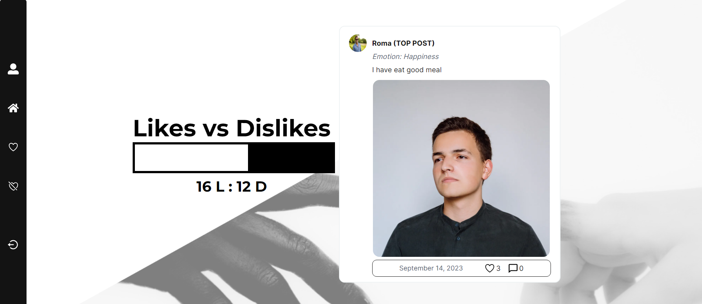

# Likesgiving

Likesgiving is a Next.js project designed to capture the essence of your daily life. It allows users to celebrate moments of joy and commiserate over frustrations by sharing experiences with others who can relate.

## Features

- **Authentication**: User authentication is handled using NextAuth.js for seamless login and registration processes.
- **State Management**: Redux Toolkit is utilized for efficient state management throughout the application.
- **Data Fetching**: Data fetching and caching are managed with the help of SWR and React Query for optimal performance.
- **Form Handling**: Formik and Yup are used for form validation and handling.
- **Date Manipulation**: Date-fns library is employed for flexible and reliable date manipulation.
- **UI Components**: Reusable UI components are provided to maintain consistency and enhance user experience.
- **API Integration**: Axios is used for making HTTP requests to the backend API.
- **Linting**: ESlint is configured for code linting to ensure code quality and maintainability.
- **Styling**: Global styles are defined using CSS modules for modular and scoped styling.
- **Infinite Scroll**: Infinite scroll functionality is implemented for smooth browsing experience.
- **Profile Management**: Users can manage their profiles with features like password change and forgot password functionality.

## Installation

1. Clone the repository.
2. Navigate to the project directory.
3. Install dependencies using `npm install`.
4. Start the development server using `npm run dev`.

## Project Structure

- `src`: Contains middleware and global configurations.
- `app`: Holds pages and components related to the application.
- `components`: Reusable UI components.
- `lib`: Utility functions and helper modules.
- `pages`: Next.js pages.
- `redux`: Redux store configuration and feature slices.
- `schemas`: Data validation schemas.

## Link to Live Project

Check out the live version of Likesgiving [here](https://likesgiving-two.vercel.app/).

## Contributing

Contributions are welcome! Please feel free to submit issues and pull requests.

